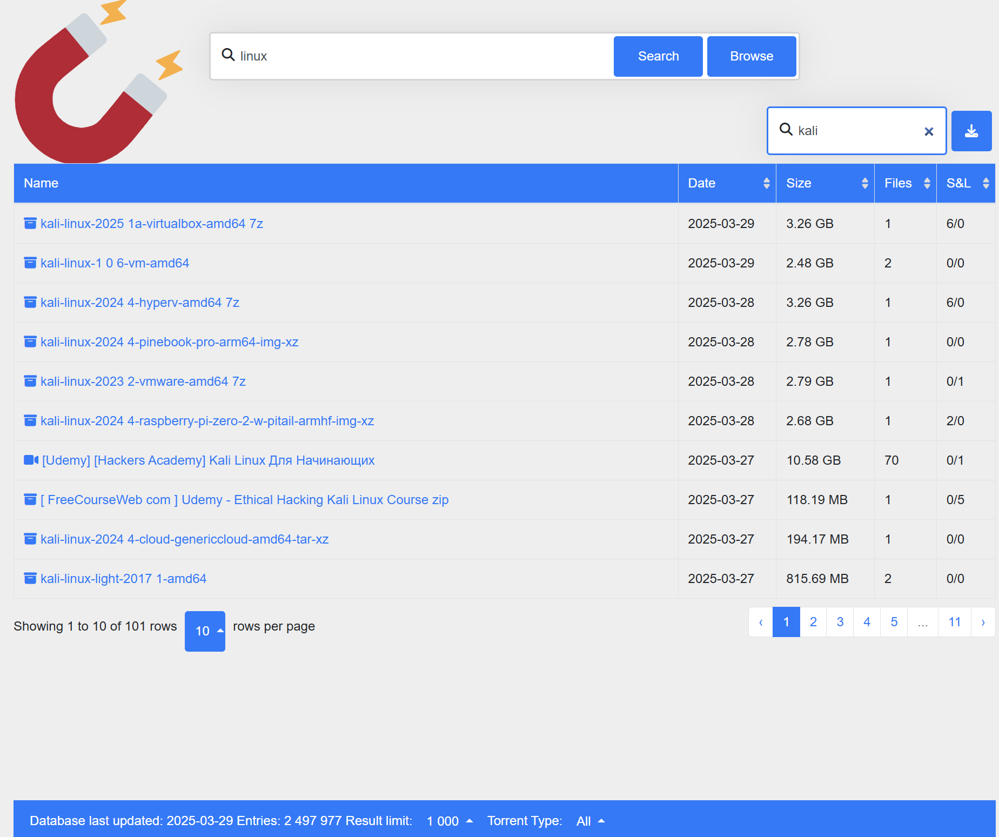

# BitTorrent-Offline-Database

Only two files to search millions of torrents sorted by type, date, size, filenumber, seeders and leechers.
Unzip the two files in a directory and just click on index.html all is included.

The result is a full text fast search engine among torrents names.

The full database of almost 3 million records is udated on a regular base (see releases)

